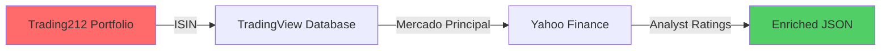

# 🧠 Trading212 Portfolio Intelligence API

<div align="center">


**API RESTful para sincronización y enriquecimiento de portafolios Trading212**

[Características](#-características) • [Instalación](#-instalación) • [API Reference](#-api-reference) • [Documentación](#-cómo-funciona)

</div>

---

## 👋 Sobre este Proyecto

> **Disclaimer:** Este es un **proyecto personal sencillo** creado por un desarrollador novato para resolver un problema específico con mi portafolio de Trading212. No tiene pretensiones de convertirse en algo más grande ni de ser "la solución definitiva" para nadie.
>
> Lo comparto públicamente porque quizás a alguien más le sirva o le dé ideas. Si encuentras bugs (que probablemente los haya), el código te parece mejorable (que seguro lo es), o simplemente no te funciona, está totalmente bien. Usa lo que te sirva y adapta lo que necesites.
>
> **No esperes soporte activo ni actualizaciones frecuentes.** Es una herramienta que hice para mí, funciona para mi caso de uso, y ya está. 🤷‍♂️

---

## 🎯 El Problema

Si inviertes en **Trading212** y has intentado analizar tu cartera con herramientas externas, te habrás encontrado con esto:

<table>
<tr>
<td width="50%">

### ❌ Ticker en Trading212
```
HY9H (SK Hynix GDR)
4HO_DE (Airbus)
ASML_AS (ASML)
```

</td>
<td width="50%">

### ✅ Ticker Real en el Mercado
```
000660.KS (Corea)
AIR.PA (Euronext París)
ASML.AS (Amsterdam)
```

</td>
</tr>
</table>

**Consecuencia:** Cuando exportas datos de T212, las APIs financieras (Yahoo Finance, Bloomberg, etc.) **no reconocen** los símbolos internos → **Análisis imposible**.

Como yo quería meter mis datos en una hoja de Google Sheets y me encontré con este problema, hice esta API para solucionarlo. Nada más, nada menos.

---

## 💡 La Solución

Esta API resuelve el problema mediante **ingeniería inversa del ISIN** (el "DNI" único de cada acción):


### Flujo de Resolución

1. **Extracción:** Obtiene el ISIN de tu posición en T212 (ej: `US78392B1070`)
2. **Rastreo Inteligente:** Consulta TradingView para encontrar el mercado líquido principal
3. **Normalización:** Convierte al formato Yahoo Finance (`000660.KS`)
4. **Enriquecimiento:** Descarga consenso de analistas (Strong Buy/Sell) y métricas

> **¿Por qué esto importa?**  
> JP Morgan, Goldman Sachs y otros analistas **no publican reportes sobre GDRs alemanes**. Analizan la acción original en su mercado nativo. Esta API encuentra automáticamente ese mercado.

---

## ✨ Características

<table>
<tr>
<td>

### 🔐 Seguro
- Sin almacenamiento de credenciales
- Solo lectura de datos
- Stateless (no sessions)

</td>
<td>

### ⚡ Rápido (bueno, relativamente)
- Procesamiento secuencial simple
- Delays anti-rate-limit
- Funciona™

</td>
<td>

### 🎯 Hace lo que necesito
- Resolución por ISIN
- Fallback a múltiples fuentes
- Ratings de analistas

</td>
</tr>
</table>

---

## 🚀 Instalación

### Prerequisitos
```bash
Python 3.10 o superior
pip (package manager)
Ganas de cacharrear
```

### Quick Start
```bash
# 1. Clonar repositorio
git clone https://github.com/tu-usuario/trading212-intelligence-api.git
cd trading212-intelligence-api

# 2. Crear entorno virtual
python -m venv venv

# Linux/Mac
source venv/bin/activate

# Windows
venv\Scripts\activate

# 3. Instalar dependencias
pip install -r requirements.txt

# 4. Iniciar servidor
uvicorn main:app --reload
```

El servidor estará disponible en `http://127.0.0.1:8000`

**Si algo no funciona:** Revisa las versiones de Python y las dependencias. Yo lo he probado en mi máquina y funciona, pero no puedo garantizar que funcione en todos los entornos. 🤷

---

## 📡 API Reference

### Documentación Interactiva

Una vez iniciado el servidor, accede a:

- **Swagger UI:** http://127.0.0.1:8000/docs
- **ReDoc:** http://127.0.0.1:8000/redoc

### Endpoint Principal

#### `POST /analyze-portfolio`

Analiza tu portafolio de Trading212 y enriquece los datos con información de mercado.

**Request Body**
```json
{
  "api_key": "TU_API_KEY_TRADING212",
  "api_secret": "TU_API_SECRET_TRADING212"
}
```

**Response (200 OK)**
```json
{
  "status": "success",
  "data": {
    "summary": {
      "total_portfolio_value": 15400.50,
      "positions_count": 12
    },
    "positions": [
      {
        "ticker": "HY9H",
        "name": "SK Hynix GDR",
        "isin_origen": "US78392B1070",
        "isin_principal": "KR7000660001",
        "ticker_mercado_principal": "000660.KS",
        "analyst_rating": "STRONG BUY",
        "recommendations": {
          "strong_buy": 35,
          "buy": 6,
          "neutral": 1,
          "sell": 0,
          "strong_sell": 0
        },
        "current_value": 1450.50,
        "portfolio_percentage": 9.4
      }
    ]
  }
}
```

**cURL Example**
```bash
curl -X POST "http://127.0.0.1:8000/analyze-portfolio" \
  -H "Content-Type: application/json" \
  -d '{
    "api_key": "YOUR_API_KEY",
    "api_secret": "YOUR_API_SECRET"
  }'
```

---

## 🧠 Cómo Funciona

### Algoritmo de Rating Ponderado

El campo `analyst_rating` no es un simple promedio. Utiliza una media ponderada basada en la confianza de cada recomendación:

| Rating | Peso | Score Range |
|--------|------|-------------|
| **Strong Buy** 🚀 | 5 | 4.50 - 5.00 |
| **Buy** 📈 | 4 | 3.50 - 4.49 |
| **Hold** ➡️ | 3 | 2.50 - 3.49 |
| **Sell** 📉 | 2 | 1.50 - 2.49 |
| **Strong Sell** 🔻 | 1 | 1.00 - 1.49 |

**Ejemplo de Cálculo:**
```
Strong Buy: 10 analistas × 5 = 50 puntos
Buy: 3 analistas × 4 = 12 puntos
Hold: 2 analistas × 3 = 6 puntos
Total: 15 analistas, 68 puntos → 68/15 = 4.53 → STRONG BUY
```

### Arquitectura de Resolución
```
┌─────────────────┐
│ Trading212 API  │
└────────┬────────┘
         │ ISIN
         ▼
┌─────────────────┐      ┌──────────────┐
│ TradingView DB  │─────▶│ Market Logic │
└─────────────────┘      └──────┬───────┘
                                │ Primary Ticker
                                ▼
                    ┌──────────────────┐
                    │ Yahoo Finance    │
                    │ - Price Data     │
                    │ - Analyst Ratings│
                    └──────────────────┘
```

---

## 🛡️ Seguridad y Mejores Prácticas

### Generación de API Keys

1. Accede a **Trading212 → Settings → API Keys**
2. Crea una nueva key con **permisos de solo lectura:**
   - ✅ Account Data
   - ✅ Metadata
   - ❌ **NO** habilites permisos de Trading

### Privacidad

- Las credenciales viajan directamente a Trading212, **no se almacenan**
- El servidor no mantiene sesiones ni cookies
- Cada request es independiente (stateless)

**Obviamente, no compartas tus API keys con nadie.** Debería ser evidente, pero por si acaso.

---

## ⚙️ Stack Tecnológico

<div align="center">

| Capa | Tecnología | Versión |
|------|------------|---------|
| **Runtime** | Python | 3.10+ |
| **Web Framework** | FastAPI | 0.115.6 |
| **Server** | Uvicorn | Latest |
| **Validation** | Pydantic | V2 |
| **Data Sources** | yfinance, TradingView | - |

</div>

---

## 📊 Consideraciones de Performance

> **⏱️ Tiempo de Respuesta**  
> El análisis procesa múltiples llamadas externas por cada posición. Para un portafolio de 50 activos, espera **15-30 segundos**. No es rápido, pero funciona para mi caso de uso. Si necesitas algo más rápido, tendrás que optimizarlo tú.

> **🔄 Rate Limiting**  
> Yahoo Finance limita requests por IP. El sistema implementa:
> - Sleep básico entre llamadas (0.05s)
> - Nada muy sofisticado, la verdad
> - Funciona para portafolios normales (~20-30 posiciones)

> **🛡️ Manejo de Errores**  
> Si un ISIN falla, la API continúa procesando el resto del portafolio. No es perfecto, pero evita que todo explote si una acción da problemas.

---

## 📝 Limitaciones Conocidas

- ⚠️ Algunos ETFs complejos pueden no tener datos de consenso
- ⚠️ Acciones de mercados emergentes sin cobertura internacional pueden fallar
- ⚠️ Los datos de analistas tienen ~24h de retraso (limitación de Yahoo Finance)
- ⚠️ El código podría estar mejor estructurado (lo sé, soy novato)
- ⚠️ No hay tests unitarios (sí, debería haberlos, pero es un proyecto personal)
- ⚠️ Probablemente hay casos edge que no he contemplado

---

## 🤝 Contribuciones

**Honestamente, no espero contribuciones activas** porque este es mi proyecto personal y no tengo tiempo para mantener un repo "de verdad". Pero si quieres:

- **Fork** el proyecto y haz lo que quieras con él
- Si encuentras algo que mejoraste, puedes abrir un PR, pero no prometo revisarlo rápido
- Si tienes dudas, abre un Issue, pero no garantizo respuestas

En resumen: **úsalo bajo tu propio riesgo** y adapta lo que necesites para tu caso.

---

## 📄 Licencia

Distribuido bajo la licencia MIT. Básicamente: haz lo que quieras con esto, pero no me hagas responsable si algo se rompe.

---

## ⚖️ Disclaimer

**Este software es una herramienta de análisis educativo hecha por un novato.**

- Los datos de mercado son proporcionados por terceros y pueden tener retraso
- No constituye asesoramiento financiero ni recomendación de inversión
- El usuario es responsable de verificar la exactitud de los datos antes de tomar decisiones
- **Yo solo hice esto para mi portafolio personal.** Si lo usas y algo no funciona, investiga tú mismo o no lo uses
- No ofrezco garantías de ningún tipo. Funciona en mi máquina™

---

<div align="center">

**Si te sirvió, me alegro. Si no, también está bien. 🤷‍♂️**

Made with ❤️ (and lots of trial & error) para mi propio uso

</div>